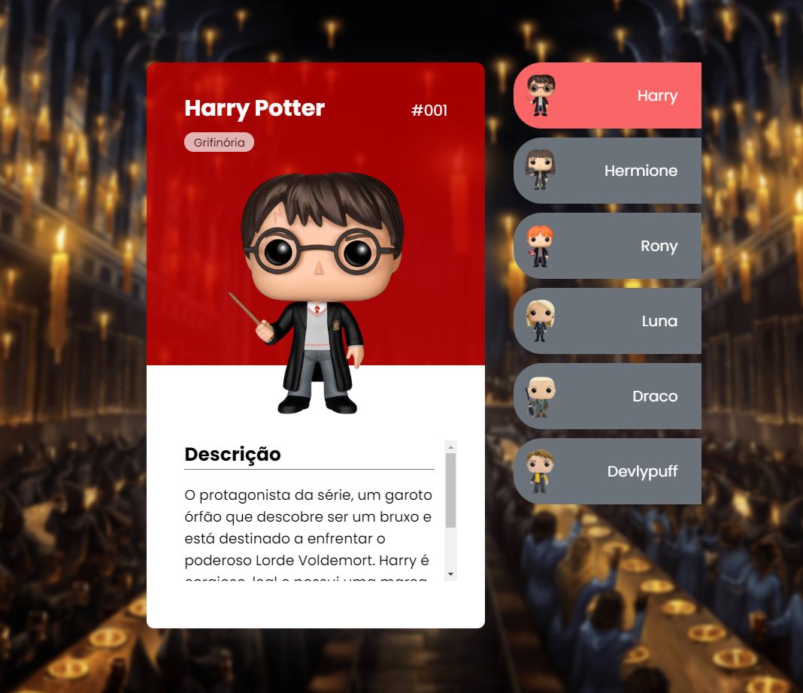

-Descrição do Projeto

Este projeto tem como objetivo criar um conjunto de cartões informativos sobre os personagens principais da saga Harry Potter. Cada cartão conterá uma descrição concisa do personagem, incluindo sua casa em Hogwarts e suas principais características.

-Personagens Incluídos

Harry Potter: O protagonista da série, corajoso e determinado, da casa Grifinória.
Hermione Granger: Inteligente e leal, da casa Grifinória.
Rony Weasley: Leal e divertido, da casa Grifinória.
Draco Malfoy: Arrogante e ambicioso, da casa Sonserina.
Luna Lovegood: Excêntrica e visionária, da casa Corvinal.
Cedrico Diggory: Justo e popular, da casa Lufa-Lufa.
Estrutura dos Cartões

-Cada cartão deverá conter as seguintes informações:

Nome do Personagem: Nome completo do personagem.
Casa em Hogwarts: A qual casa o personagem pertence.
Descrição: Um breve parágrafo descrevendo a personalidade, história e características marcantes do personagem.
Imagem: Uma imagem representativa do personagem

-Tecnologias Utilizadas
 HTML, CSS, JavaScript para a criação dos cartões

-Contribuições
Contribuições são bem-vindas! Se você quiser adicionar novos personagens, melhorar as descrições existentes ou implementar novas funcionalidades, fique à vontade para abrir um pull request.

